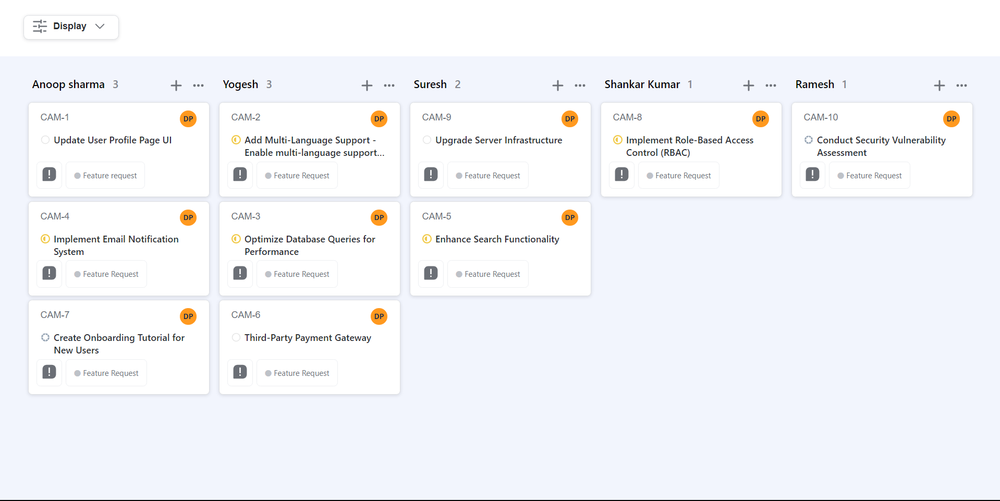

# Kanban Board

## Overview

This Kanban board is a project management tool that helps you organize tasks, issues, or any work items effectively. It provides multiple features to streamline your workflow, including grouping tasks by status, user, and priority, as well as sorting options for both priority and title.

## Features

### Grouping by Status:

Easily visualize the progress of tasks by grouping them based on their status, such as "To-Do," "In Progress," "Done," and more.

### Grouping by User:

Assign tasks to team members and group them by user, making it simple to track individual workloads and responsibilities.

### Grouping by Priority:

Prioritize tasks by assigning priority levels (e.g., Low, Medium, High) and group them accordingly.

### Sorting by Priority:

Sort tasks within each group by priority, ensuring that the most important tasks are easily identifiable.

### Sorting by Title:

Arrange tasks alphabetically by title for quick reference.

## Usage

### Creating Tasks:

Add new tasks or issues to the board, specifying their status, user assignment, and priority.

### Grouping Tasks:

To group tasks by status, select the desired status from the dropdown menu.
To group tasks by user, choose the user's name.
To group tasks by priority, select the priority level.

### Sorting Tasks:

To sort tasks within a group by priority, click the "Sort by Priority" button.
To sort tasks within a group alphabetically by title, click the "Sort by Title" button.

### Managing Tasks:

You can drag and drop tasks between groups to update their status or assignment. Additionally, use the edit and delete options to modify or remove tasks as needed.

# Getting Started with Create React App

This project was bootstrapped with [Create React App](https://github.com/facebook/create-react-app).

## Available Scripts

In the project directory, you can run:

### `npm start`

Runs the app in the development mode.\
Open [http://localhost:3000](http://localhost:3000) to view it in your browser.

The page will reload when you make changes.\
You may also see any lint errors in the console.

### `npm test`

Launches the test runner in the interactive watch mode.\
See the section about [running tests](https://facebook.github.io/create-react-app/docs/running-tests) for more information.

### `npm run build`

Builds the app for production to the `build` folder.\
It correctly bundles React in production mode and optimizes the build for the best performance.

The build is minified and the filenames include the hashes.\
Your app is ready to be deployed!

See the section about [deployment](https://facebook.github.io/create-react-app/docs/deployment) for more information.

### `npm run eject`

**Note: this is a one-way operation. Once you `eject`, you can't go back!**

If you aren't satisfied with the build tool and configuration choices, you can `eject` at any time. This command will remove the single build dependency from your project.

Instead, it will copy all the configuration files and the transitive dependencies (webpack, Babel, ESLint, etc) right into your project so you have full control over them. All of the commands except `eject` will still work, but they will point to the copied scripts so you can tweak them. At this point you're on your own.

You don't have to ever use `eject`. The curated feature set is suitable for small and middle deployments, and you shouldn't feel obligated to use this feature. However we understand that this tool wouldn't be useful if you couldn't customize it when you are ready for it.

## Learn More

You can learn more in the [Create React App documentation](https://facebook.github.io/create-react-app/docs/getting-started).

To learn React, check out the [React documentation](https://reactjs.org/).

### Code Splitting

This section has moved here: [https://facebook.github.io/create-react-app/docs/code-splitting](https://facebook.github.io/create-react-app/docs/code-splitting)

### Analyzing the Bundle Size

This section has moved here: [https://facebook.github.io/create-react-app/docs/analyzing-the-bundle-size](https://facebook.github.io/create-react-app/docs/analyzing-the-bundle-size)

### Making a Progressive Web App

This section has moved here: [https://facebook.github.io/create-react-app/docs/making-a-progressive-web-app](https://facebook.github.io/create-react-app/docs/making-a-progressive-web-app)

### Advanced Configuration

This section has moved here: [https://facebook.github.io/create-react-app/docs/advanced-configuration](https://facebook.github.io/create-react-app/docs/advanced-configuration)

### Deployment

This section has moved here: [https://facebook.github.io/create-react-app/docs/deployment](https://facebook.github.io/create-react-app/docs/deployment)

### `npm run build` fails to minify

This section has moved here: [https://facebook.github.io/create-react-app/docs/troubleshooting#npm-run-build-fails-to-minify](https://facebook.github.io/create-react-app/docs/troubleshooting#npm-run-build-fails-to-minify)
